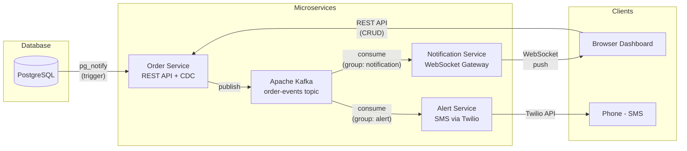

# Real Time Event Streaming Platform 

A microservices-based system that pushes live database changes to connected clients. Built with PostgreSQL, Kafka, WebSockets, and Docker.

The core idea: instead of clients polling the server every few seconds, the database itself notifies the system whenever something changes. That change flows through Kafka to a WebSocket server, which pushes it to every connected browser tab instantly.

---

## How it works



1. A row gets inserted, updated, or deleted in the `orders` table
2. A PostgreSQL trigger fires and calls `pg_notify` with the full row as JSON
3. The Order Service has a dedicated connection running `LISTEN order_changes` — it picks up the notification and publishes it to a Kafka topic (`order-events`)
4. Two independent consumers read from that topic:
   - **Notification Service** broadcasts the event to all WebSocket clients
   - **Alert Service** sends SMS to the customer's phone number (via Twilio)

This means even direct SQL changes (not through the API) get captured and pushed to clients.

---

## Tech stack

| Component            | What it does                              |
|----------------------|-------------------------------------------|
| PostgreSQL 15        | Database + CDC via triggers/LISTEN-NOTIFY |
| Apache Kafka         | Decouples producers from consumers        |
| Order Service        | Express REST API + CDC listener           |
| Notification Service | Kafka consumer + WebSocket broadcaster    |
| Alert Service        | Kafka consumer + Twilio SMS sender        |
| Frontend             | Vanilla JS dashboard served by Nginx      |
| Docker Compose       | Runs everything with one command          |

---

## Project structure

```
realtime-order-tracker/
├── docker-compose.yml
├── db/
│   └── init.sql                  # schema, trigger, seed data
├── services/
│   ├── order-service/
│   │   └── src/
│   │       ├── index.js          # express server
│   │       ├── config/db.js      # pg pool + CDC client
│   │       ├── config/kafka.js   # kafka producer
│   │       ├── routes/orders.js  # CRUD endpoints
│   │       └── cdc/listener.js   # pg_listen -> kafka
│   ├── notification-service/
│   │   └── src/index.js          # kafka consumer + websocket
│   ├── alert-service/
│   │   └── src/
│   │       ├── index.js          # kafka consumer entry point
│   │       └── channels/
│   │           ├── email.js      # nodemailer (optional)
│   │           └── sms.js        # twilio integration
│   └── frontend/
│       ├── nginx.conf            # reverse proxy for API + WS
│       └── public/               # static HTML/CSS/JS
```

---

## Running it

You need Docker and Docker Compose installed. That's it.

```bash
cd realtime-order-tracker
docker-compose up --build
```

Wait for the logs to show all services are ready, then open:

```
http://localhost:8090
```

To stop everything:

```bash
docker-compose down        # stop containers
docker-compose down -v     # stop + wipe the database
```

---

## API

All endpoints return `{ success: true/false, data: ... }`.

| Method   | Endpoint           | What it does      |
|----------|--------------------|-------------------|
| GET      | /api/orders        | list all orders   |
| GET      | /api/orders/:id    | get one order     |
| POST     | /api/orders        | create order      |
| PUT      | /api/orders/:id    | update order      |
| DELETE   | /api/orders/:id    | delete order      |

Example — create an order:

```bash
curl -X POST http://localhost:3001/api/orders \
  -H "Content-Type: application/json" \
  -d '{"customer_name":"Jane","customer_phone":"+1555123456","product_name":"Galaxy S24","status":"pending"}'
```

WebSocket events come through `ws://localhost:8090/ws`:

```json
{
  "type": "order_event",
  "operation": "UPDATE",
  "data": { "id": 1, "customer_name": "Jane", "status": "shipped", ... },
  "timestamp": "2026-05-19T20:00:00.000Z"
}
```

---

## SMS notifications

SMS is handled by Twilio. The alert service runs as a separate Kafka consumer (its own consumer group), so it processes events independently from the WebSocket service.

Twilio credentials go in `docker-compose.yml` under the `alert-service` environment:

```yaml
TWILIO_ACCOUNT_SID: "ACxxxxx"
TWILIO_AUTH_TOKEN: "xxxxx"
TWILIO_PHONE_NUMBER: "+1xxxxxxxxxx"
```

If credentials are missing, the service runs in simulation mode and just logs what it would send.

On a Twilio trial account, you can only send SMS to verified numbers. Add them in the Twilio console under Verified Caller IDs.

---

## Why these choices

**PostgreSQL LISTEN/NOTIFY for CDC** — It catches every change at the database level, including direct SQL inserts. No extra infrastructure needed beyond Postgres itself. The trade-off is it's Postgres-specific, but for this use case it's the simplest approach that actually works.

**Kafka as the middle layer** — Without Kafka, the Order Service would need to know about every consumer (WebSocket server, SMS service, etc). Kafka decouples them. It also gives us durability — if a consumer goes down, it picks up where it left off when it comes back. The topic has 3 partitions keyed by order ID, so we get ordering guarantees per order.

**WebSocket over polling/SSE** — Full-duplex, low overhead, native browser support. The connection stays open so updates arrive instantly.

**Separate consumer groups** — The notification service and alert service each have their own Kafka consumer group. This means they both independently receive every event. If one goes down, the other keeps working.

---

## Scaling notes

- The notification service can be scaled horizontally behind a load balancer (each instance in its own consumer group for broadcast)
- Kafka partitioning means multiple consumers in the same group can split the load
- The CDC listener reconnects automatically on connection failure
- Services use Docker restart policies (`on-failure`) for basic fault tolerance
- WebSocket connections are tracked in a Set for O(1) add/remove

---
